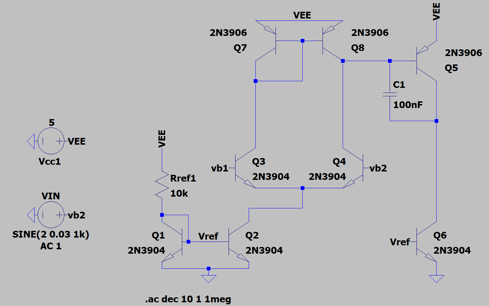
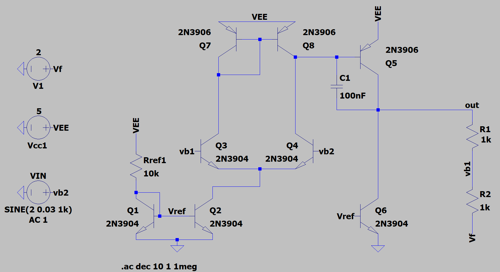
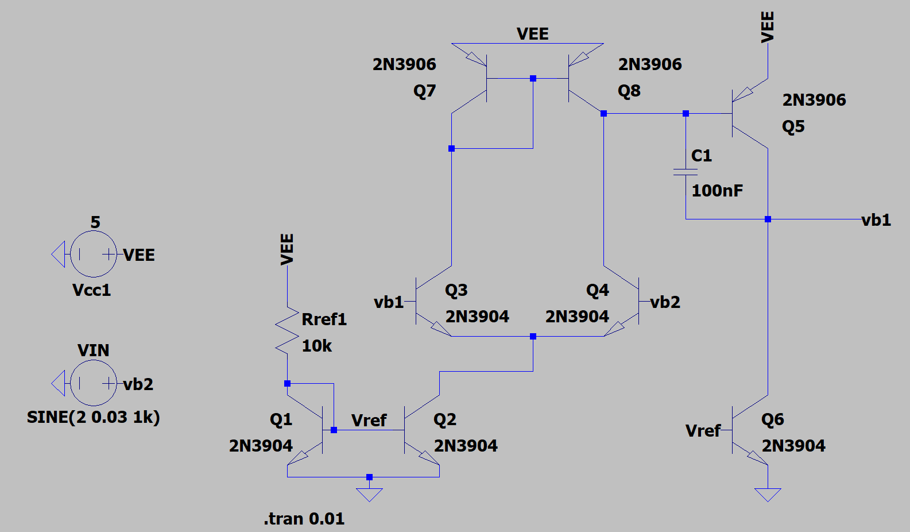
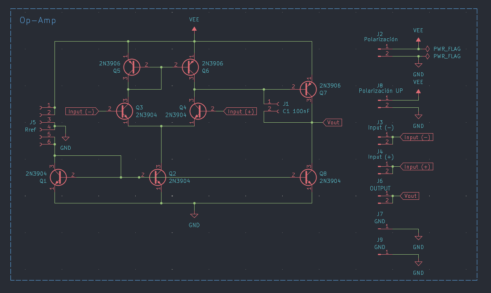
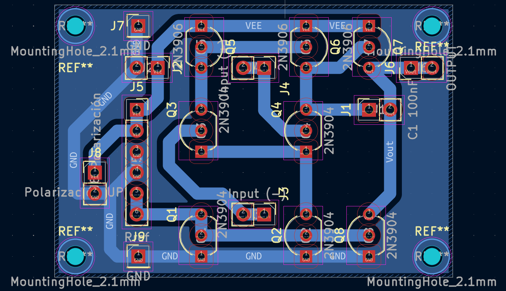
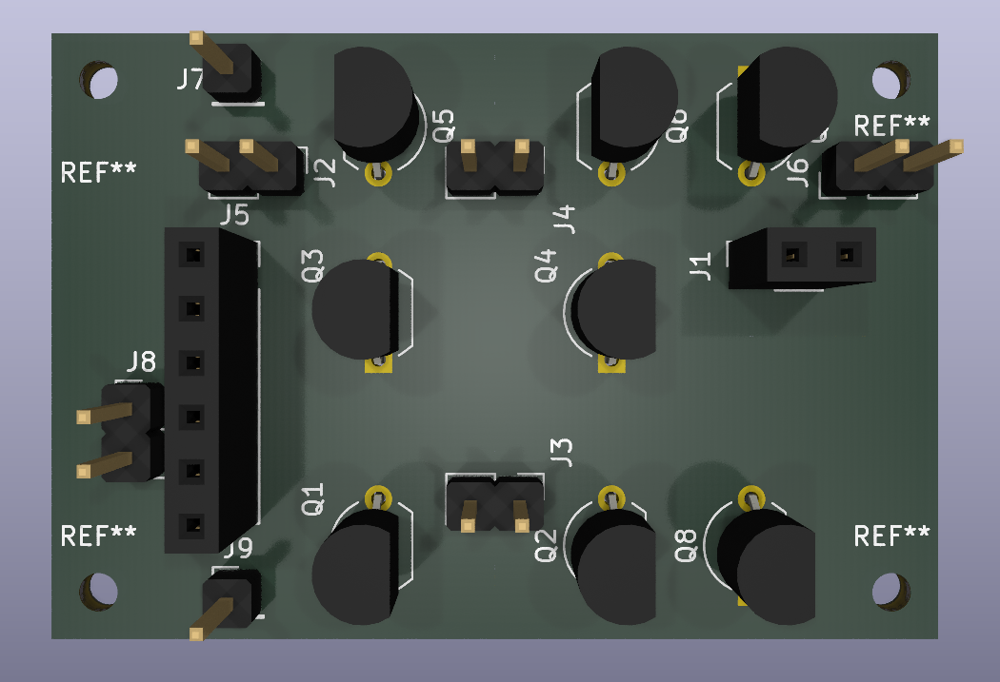
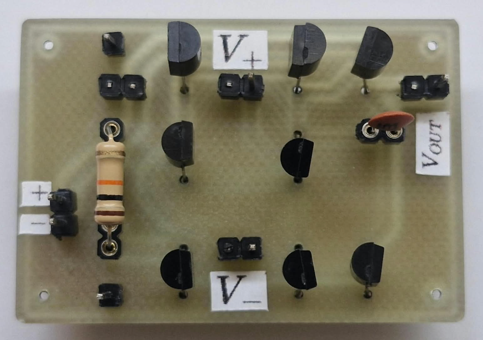

# Amplificador Operacional con BJTs

Diseño de un amplificador operacional discreto construido con transistores BJT, incluyendo esquemático, simulación en LTspice y layout en KiCad.
### Integrantes:
Ángel Arzuaga, María Camila Castilla, Cristian Sepúlveda y Esteban Toro

## Descripción

Este proyecto consiste en construir, desde cero, un amplificador operacional usando transistores bipolares individuales, en lugar de partir de un circuito integrado ya armado. La idea es entender cómo funciona por dentro un componente que normalmente se usa como una "caja negra", diseñando cada etapa del circuito; entrada, amplificación y salida.

Una vez terminado el diseño, se puso a prueba el circuito en dos configuraciones clásicas para verificar que funcionara correctamente. La primera fue como amplificador no inversor con ganancia 2, es decir, la señal de salida sale duplicada respecto a la de entrada, manteniendo la misma polaridad. La segunda fue como buffer (o seguidor de voltaje), una configuración que no amplifica la señal pero es muy útil para aislar etapas de un circuito sin alterar el voltaje que pasa por ellas.

## Simulación en LTspice


*Esquemático simulado en LTspice, base de los resultados de ganancia y ancho de banda.*


*Esquemático simulado en LTspice, en configuración no inversora de ganancia 2.*


*Esquemático simulado en LTspice, en configuración de buffer.*

## Esquemático en KiCad


*Esquemático completo del amplificador diseñado en KiCad.*

## PCB


*Distribución de componentes y pistas del PCB.*


*Render 3D del PCB terminado.*



*PCB terminado con componentes soldados.*

## Componentes utilizados

| Componente | Valor / Modelo | Datasheet |
|---|---|---|
| NPN | 2N3904 | [datasheet](datasheets/2N3904.pdf) |
| PNP | 2N3906 | [datasheet](datasheets/2N3906.pdf) |
| $R_{ref}$ | 10 kΩ | — |
| $C_1$ | 100 pF | — |

El amplificador se diseño para que tanto $R_{ref}$ como $C_1$ puedan ser intercambiables a gusto del diseñador o usuario final.

## Estructura del repositorio

```
amplificador-op-bjt/
├── kicad/          # Esquemático y PCB (KiCad)
├── ltspice/         # Simulaciones y resultados (LTspice)
├── datasheets/       # Hojas de datos de los componentes usados
├── docs/
│   └── images/         # Capturas de esquemático, gráficas, fotos
├── gerbers/           # Archivos de fabricación del PCB
└── LICENSE
```

## Cómo abrir los archivos

**KiCad** (versión 9.0 o superior):
1. Abre KiCad
2. File → Open Project → selecciona `kicad/amp-op-bjt.kicad_pro`

**LTspice**:
1. Abre LTspice
2. File → Open → selecciona el archivo `.asc` dentro de `ltspice/`
3. Ejecuta la simulación con Simulate → Run

## Licencia

Este proyecto está licenciado bajo **CERN-OHL-P v2**. Ver [LICENSE](LICENSE) para el texto completo.
